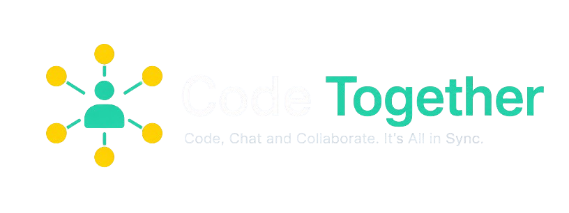

<p align="center">
  
</p>

A collaborative, real-time code editor where multiple users can join a room, share a room ID, and work on code together — with chat, video calls, collaborative drawing, code execution, and an AI Copilot.


## 🔮 Features

- 💻 Real-time collaboration on code editing across multiple files
- 📁 Create, open, rename, delete, and organize files and folders (including opening a local directory)
- 💾 Download the entire workspace as a zip file
- 🚀 Unique room generation with room ID / shareable link
- 🌍 Language support with syntax highlighting and auto-language detection
- 🚀 Code execution via SandboxAPI (stdin supported)
- ⏱️ Instant file and folder sync across all connected users
- 📣 Join / leave notifications
- 👥 User presence list with online / offline indicators
- 💬 Real-time group chat
- 📹 In-room video calls (WebRTC: mute, camera toggle, accept / reject)
- 🎩 Typing indicators and remote cursor / selection highlights
- 🔠 Adjustable font size and font family
- 🎨 Multiple editor themes
- 🎨 Collaborative drawing canvas (tldraw) with real-time sync
- 🤖 AI Copilot (OpenRouter) — generate code, then copy, insert, or replace file content

> **Note:** Room state is kept in memory on the server. Restarting the server clears rooms (clients hold the latest local copy until reconnect).

## 💻 Tech Stack


**External services:** [SandboxAPI](https://sandboxapi.dev/) (code run) · [OpenRouter](https://openrouter.ai/) (Copilot)

## ⚙️ Installation

### Method 1: Manual Installation

1. **Fork** this repository (top-right on GitHub), then **clone** your fork:
   ```bash
   git clone https://github.com/<your-username>/code-togeather.git
   cd code-togeather
   ```

2. **Configure environment files**

   Copy the examples and edit values:

   ```bash
   cp client/.env.example client/.env
   cp server/.env.example server/.env
   ```

   **Client** (`client/.env`):

   ```bash
   VITE_BACKEND_URL=http://localhost:3000
   VITE_SANDBOX_API_URL=https://sandboxapi.p.rapidapi.com/v1
   VITE_SANDBOX_API_KEY=<your_rapidapi_key>
   ```

   **Server** (`server/.env`):

   ```bash
   PORT=3000
   COPILOT_API_KEY=<your_openrouter_api_key>
   ```

   - `VITE_BACKEND_URL` — Socket.IO + Copilot API base URL (use `http://localhost:3000` locally)
   - `VITE_SANDBOX_API_KEY` — RapidAPI key for [SandboxAPI](https://rapidapi.com/sandboxapidev/api/sandboxapi) (needed for Run Code)
   - `COPILOT_API_KEY` — [OpenRouter](https://openrouter.ai/) API key (needed for Copilot)

3. **Install dependencies** (no root `package.json` — install in both apps):

   ```bash
   cd server && npm install
   cd ../client && npm install
   ```

4. **Start the apps** (two terminals):

   ```bash
   # Terminal 1 — backend (http://localhost:3000)
   cd server
   npm run dev

   # Terminal 2 — frontend (http://localhost:5173)
   cd client
   npm run dev
   ```

5. Open **http://localhost:5173/**

### Method 2: Docker Compose

1. Install [Docker Desktop](https://www.docker.com/products/docker-desktop/) and verify:
   ```bash
   docker --version
   ```

2. From the repo root, set env files as in Method 1 (`client/.env`, `server/.env`), then:

   ```bash
   docker compose up --build
   ```

3. Open **http://localhost:5173/**  
   Backend listens on **http://localhost:3000/**

### Method 3: Prebuilt Docker images (optional)

```bash
docker pull harsHdokyc/code-togeather-server:latest
docker pull harsHdokyc/code-togeather-client:latest

docker run -d -p 3000:3000 --name code-togeather-server harsHdokyc/code-togeather-server:latest
docker run -d -p 5173:5173 --name code-togeather-client harsHdokyc/code-togeather-client:latest
```

> Prefer **Method 2** for local development so your current source and env files are used.

## 📁 Project structure

```
code-togeather/
├── client/                 # React + Vite frontend
│   ├── src/
│   │   ├── components/     # Editor, files, chat, drawing, sidebar, video, …
│   │   ├── context/        # Socket, File, Chat, Copilot, Run, VideoCall, …
│   │   ├── pages/          # Home + Editor room
│   │   └── api/            # SandboxAPI client
│   └── .env.example
├── server/                 # Express + Socket.IO backend
│   ├── src/server.ts       # Rooms, sync, WebRTC signaling, /api/copilot
│   └── .env.example
└── docker-compose.yml
```

## 🔮 Features for Next Release

- **Admin permissions:** room-level roles to control access and privileged actions

## 🌟 Appreciation for Resources

Special thanks to:

- **SandboxAPI** — code execution
  - [Documentation](https://sandboxapi.dev/)
  - [RapidAPI](https://rapidapi.com/sandboxapidev/api/sandboxapi)

- **tldraw** — collaborative drawing
  - [Repository](https://github.com/tldraw/tldraw)
  - [Docs](https://tldraw.dev/)

- **OpenRouter** — Copilot LLM access
  - [OpenRouter](https://openrouter.ai/)
  - [Docs](https://openrouter.ai/docs)
